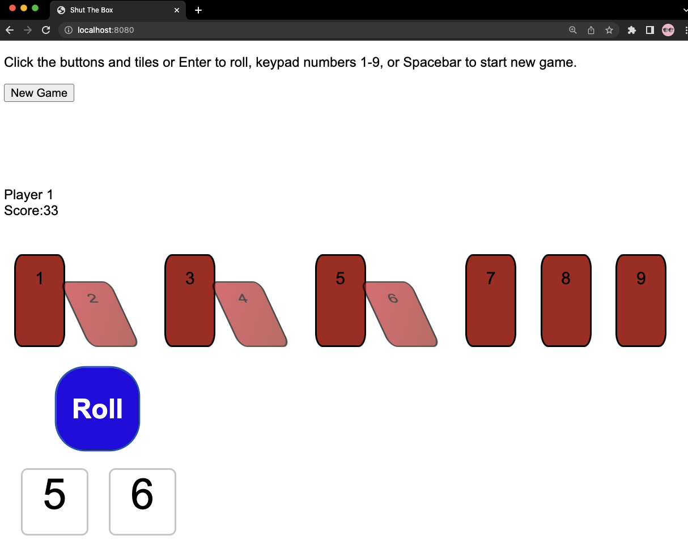

# The Shut The Box

## Game rules are here: https://www.mastersofgames.com/rules/shut-box-rules.htm

 1. Roll the dice
 2. Click on the tiles (0-9) in any combination that equals the total shown on the dice
 3. Selected tile(s) will be closed and no longer usable for the current game

The goal is to finish the game with a score of 0.
If the score is less than 7, only 1 die will be rolled.
The game ends when the score is calculated as 0, or no combination of open tiles equals the dice total.

## JS implementation

Written in JS with minimal styling

Just double-click on index.html in /path/to/the/repository/written_in_js/index.html or serve it with your favorite web server.
